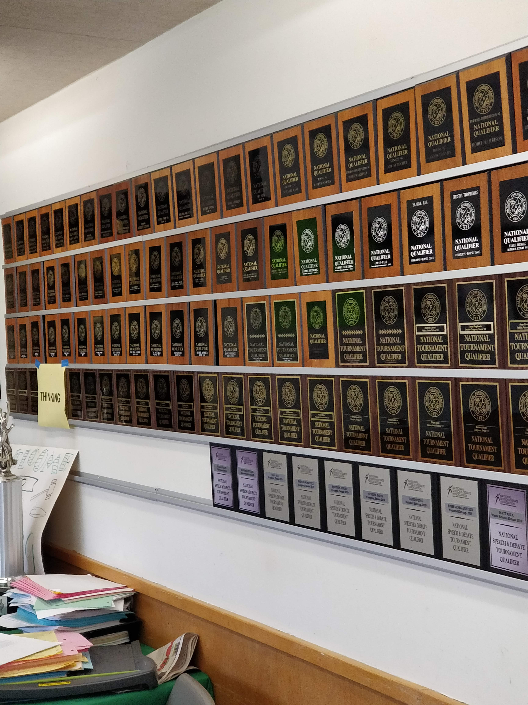

Pokud jste ještě nečetli o mém prvním dni na Miramonte, tak to rychle napravte [tady](https://blog.erikstoklasa.cz/2019/10/24/prvni-den-na-kalifornske-skole/). Píšu tam o MATS dnu, teď už ale k tématu. Škola na Miramonte začíná určité dny v 8 a další v 8:30, na to druhé jsem zvyklý už z mého pražského Gymnázia, taky nemusím vstávat vůbec brzo, protože moje hostitelská rodina bydlí skoro úplně u školy, za 10 minut jsem tam pěšky, takže skvělé. Celý den je rozdělený do 45 minutových bloků v pondělí a v ostatní dny do 90 minutových bloků. Každý den končíme v 3:05, což je příjemně překvapující, v porovnáním s mojí střední školou v ČR. V dalších odstavcích budu mluvit o svém prvním vyučovacím dni v Kalifornii.

Začíná to první hodinou, měl jsem Čínštinu s Ms. Holland, vejdu do třídy a tak 90% studentů jsou Asiati, ups, asi jsem si to neměl dávat, všichni říkali, že je to těžký, což se později opravdu potvrdilo, ale já to i přes to chtěl zkusit. Byla to ale Čínština pro úplné začátečníky, to bylo pro mé neexistující čínské schopnosti adekvátní. Přidělili jsme si čínská jména, moje je 荀昂人, což se čte xún áng rén.

Druhou hodinu jsem měl fyziku s Mr. Shortenhaus, ostatní studenti mi tohodle učitele doporučovali, že prý dělá hodně experimentů, což je pravda. Na fyziku jsme si ze školní knihovny půjčili učebnice, které jsou mimochodem extrémně obsáhlé, mám dvě a vyrovnají se střídmě krmenému Retrívrovi, jak ve váze, tak i v ceně, ty učebnice totiž stojí normálně přes pět tisíc, což je poněkud brutální.

Třetí hodinu mám angličtinu s Mr. Simmons, postrach školy, který po studentech chce fakt hodně esejí, zatím z angličtiny mám docela strach. Také jsme si vyzvedli román, který budeme číst, The Adventures Of Huckleberry Finn.

Po třetí hodině přichází brunch, něco mezi snídaní a obědem, prostě svačinová přestávka, trvá 15 minut, což je na přesun do části školy, která má stoly, snězení svačiny a vrácení se nazpátek do učebny tak akorát. Normální přestávky tu mají 5 minut, což je fakt brutální, kampus je opravdu velký a dostat se z jedné části do druhé vám může trvat právě zmíněných 5 minut, pokud ovšem víte, do jaké učebny přesně jdete, což jsem samozřejmě nevěděl, ale studenti mi vždycky poradili.

Čtvrtou hodinu mám programování v Javě s Ms. Boyko, to je jedna z mých nejlepších vyučujících na škole. Vždycky nám před hodinou vypráví vtipy o IT a vysvětluje koncepty fakt dobře (bit by bit). První dojem na jedničku.

Pátou hodinu mám matematiku s Ms. Watson, učitelkou, která je taky trenérkou v běžeckém klubu, o kterém budu psát později. První hodina se mi zdála poměrně základní, probírali jsme to stejné, co jsem už znal z mé střední školy v Praze. Nakonec jsem se proto po dvou týdnech rozhodl vyměnit si matematiku za fotografování s Ms. Churchill, což byl mnohem zajímavější předmět.

Šestou hodinu mám historii USA s Mr. Compton, skvělý učitel, který se snaží historii vyprávět zajímavými příběhy a nenutí nás si pamatovat data každé bitvy v období občanské války. Ale musím říct, že mu vůbec nerozumím, jestli znáte rappera Eminema, ani on by nestíhal luštit slova, která pan Compton střílí jako z kulometu.

Sedmou hodinu mám Public Speaking s Ms. Plant, fajn učitelka, která vede na Miramonte práve Public Speaking klub. V celé USA je právě ten náš klub jedním z nejlepších (viz obrázek všech trofejí). Před odjezdem do Kalifornie jsem byl z tohohle předmětu trochu vyděšený, sice miluju prezentování, ale všechno to dělat v angličtině je poměrně stresující. Každopádně můj strach z tohohle předmětu nebyl vůbec na místě. Hodiny tu mají jak nováčci, tak i pokročilí ve stejnou hodinu a díky to umožňuje skvělé věci mají tu tzv. Buddy System. Každý pokročilý (Veteran) dostane na starosti nováčka (Rookie) a Veterans pomáhají nováčkům s prvními přednesy a kongresovými debatami (o těch někdy příště). Celkově je Public Speaking poměrně hodně práce, ale stoprocentně se to vyplatí. Je prostě fakt hustý být na hodině s lidmi, kteří na celostátních soutěžích vyhrávají první místa, a že si to opravdu zaslouží.

