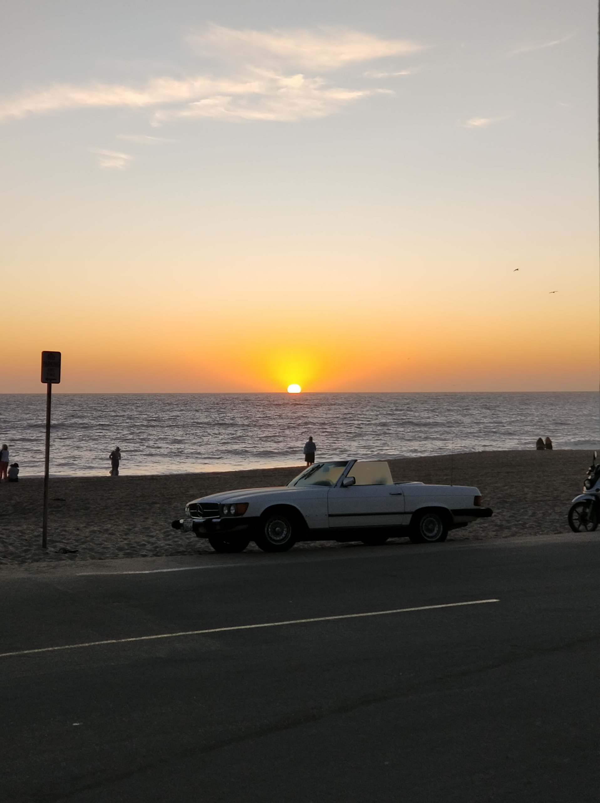
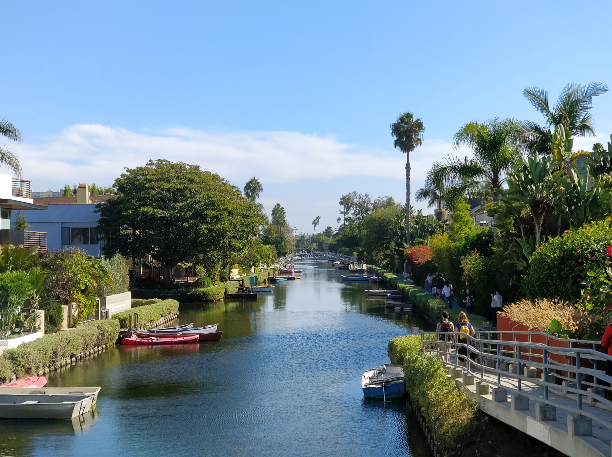
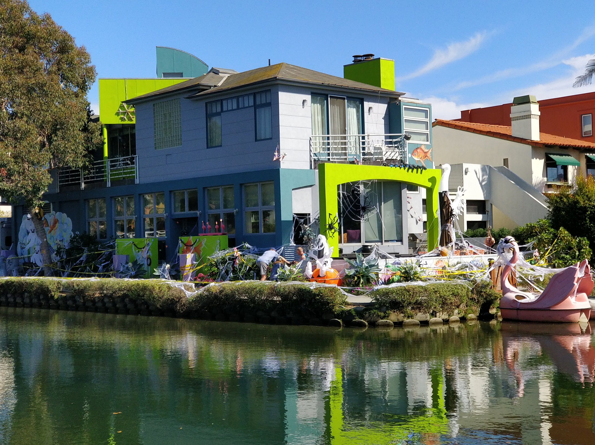

Dámy a pánové, dnešní let bude trvat hodinu a třicet minut, pohodlně se usaďte a užijte si let. Takhle začalo další z mých dobrodružství, na které mě vzala má kalifornská rodina. Nejprve jsme měli letět na úplně druhou světovou stranu, do Idaha (menší stát na sever od San Francisca), tam ovšem udeřila silná bouře, takže bychom byli celý den jen zavření doma, přebukovali jsme tedy letenky a hurá do teplejších krajin – do Los Angeles. Jestli jste někdo hráli počítačovou hru GTA, tak tuhle metropoli budete znát lépe než své boty. Přesně takhle jsem to měl já, je až zvláštní, jak jsem určité oblasti poznával a uměl jsem se ve městě dobře orientovat.

Náš první den jsme strávili v Gettyho muzeu umění. Já si na umění moc nejdu, ale byl odtud krásný výhled na celé město. LA je fakt obrovské, žije tady asi 13 mil. lidí a z výhledu jsem ani zdaleka nespatřil hranice města.

`youtube: https://youtu.be/bqEs0j5MgLI`

Výhled na Los Angeles, po levé straně v dálce můžete spatřit downtown

Po Gettyho muzeu jsme se s Liamem vydali na prozkoumávání univerzitního kampusu UCLA. Jejich kampus je taky obří, ale překvapivě tam chodí o deset tisíc lidí méně než na Univerzitu Karlovu v Praze. Potom jsme se šli podívat na noční Santa Monica molo.

`youtube: https://www.youtube.com/watch?v=EDb303T-B1w`

Druhý den jsme strávili ve na pláži Venice. V LA je stále přibližně 32 °C, na což si nestěžuju, oproti asi 26 °C v San Franciscu. Vodní kanály ve Venice jsou hodně zajímavé, domy tady stojí majlant, ale furt to nemá na domy v Beverly Hills, kde bydlí spousta miliardářů a filmových hvězd. Po Venice jsme si dali mexické jídlo, které je v Kalifornii naprosto famózní, a vyrazili jsme směr Malibu. Nejhezčí pláž a místo, které jsem kdy viděl, je právě Malibu. Jemný písek, žádní turisté a vlny ideální pro surfování. Když se schylovalo k západu slunce tak jsme dokonce viděli i nahodilou žádost o ruku, je to tady opravdu kouzelné místo.

`youtube: https://www.youtube.com/watch?v=8j9zMok6two`
