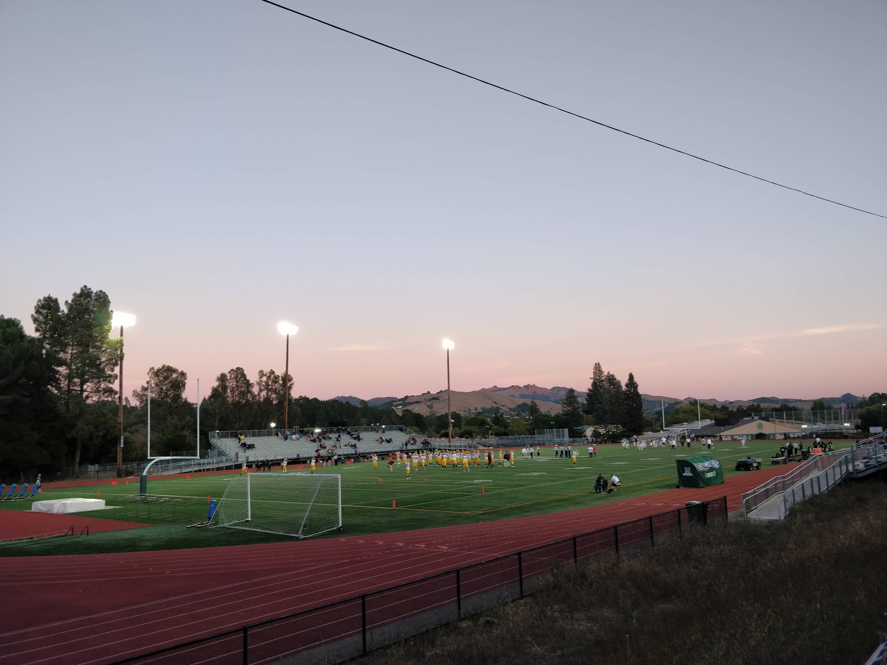

Můj první den ve škole, 12. srpna začal pozvolna, v USA nejsem ještě ani týden, a už hurá do školy. Den před začátkem školy mě Liam, můj host bratr, provedl celým kampusem na Miramonte, je to obrovská škola, učí se tu asi 1300 studentů. Nebylo to ale tak horké, první den jsme řešili jen organizační nutnosti.

Jako první jsem měl jsem pohovor se studijní asistentkou, ptala se mě, jestli jsem měl už nějaké zkušenosti s programováním, které jsem si zvolil na vyšším stupni, to samé s fyzikou. Po krátkém pohovoru jsem dostal svoji studentskou kartičku, na kterou mě museli předtím i vyfotit. Vydávání kartiček probíhalo v obrovské tělocvičně, všichni pomateně pobíhali z jedné strany na druhou a já jsem byl ještě dvakrát tak zmatený.

Po tom, co jsem si všechno vyzvedl a vyřídil, tak mě čekala prohlídka celé školy, na Miramonte mají takzvanou Link Crew, to jsou studenti, kteří provázejí nováčky po škole. Po škole mě provázel Ibby, třeťák na Miramonte. Já jsem na Miramonte taky ve třeťáku, ale v Česku jsem ve druháku, mají to tu totiž posunuté o rok, na střední se začíná v naší deváté třídě, které se tu říká Freshmen, poté je tu Sophomore, už zmíněný Junior a ukončení střední školy - Senior.

Ibby byl strašně přátelský a snažil se mi říct o škole úplně všechno, setkali jsme se i s jedním učitelem, Mr. Rose, který pořád jen vtipkoval o jeho klubu, ke kterém studenti simulují reálný proces soudu, a tak první dojem na zdejší učitele a studenty mám úplně skvělý.

Po prvním organizačním dnu přichází další den a s ním vyučování. Ještě před svým příjezdem jsem si mohl zvolit 6 až 7 předmětů, které tu budu studovat, v tomhle je započítaná i povinná angličtina a historie USA. Z těch zbývajících jsem si vybral předměty Mandarin 1, AP Physics 1, AP Computer Science Java, Algebra 2 a Public Speaking 1. Moje hostitelská mamka, Maya, mě už při vyzvednutí z letiště varovala, že jsem si toho naložil docela hodně, a že když budu potřebovat pomoc, tak Miramonte nabízí Peer Tutoring, kde studenti doučují ostatní studenty. V příštím článku budu psát o svých předmětech, tak čtěte dále.

