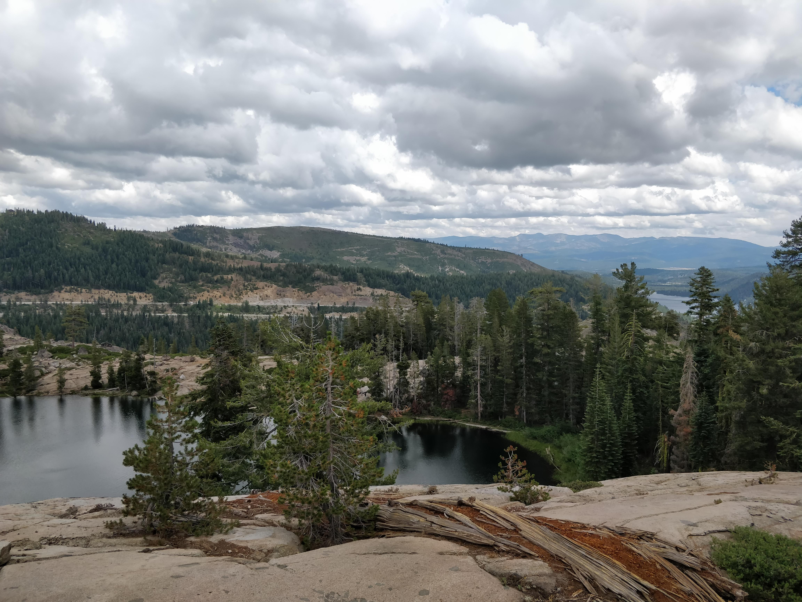

Hned na můj první víkend v Kalifornii mě rodina vzala k jezeru Tahoe, konkrétně na jejich "chatu" v Truckee, město vedle jezera Tahoe. V okolí jsou hory vysoké asi 6000 stop, což je asi 2000 m. V blízkosti Truckee se taky nachází také bývalé Olympijské městečko Squaw Valley, konaly se tu zimná Olympijské hry v roce 1960. Cestou tam jsme hráli hru, kdo nejdříve uvidí na cedulích v okolí dálnice všechna písmena abecedy. Kieran, můj nejmladší host brácha, je v tom prý mistr, ale dostat se k písmenu Z je podle něho prý doopravdy kumšt. Na místě se k nám přidal kamarád Kierana a jeho mamka. Dostávám se ke svému dřívějšímu vyjádření "chaty", tak totiž nazvala moje host mamka obydlí, do kterého McBrides jezdí na víkendy. Jako chatu bych celý barák ale vůbec nepopsal, spíš jako rekreační sídlo, protože to bylo opravdu obrovský. Jedna z věcí, která mě překvapila byla taková větší bouda pro psa před domem. Maya, moje host mamka, mi vysvětlila, že se jedná o box, do kterého dávají odpadky, kvůli medvědům. Prý se tady medvědi pohybují úplně normálně, což mě celkem zarazilo.

V Truckee jsme vyrazili na túru k ledovcovým jezerům, cesta trvala pár hodin, ale nakonec jsme předci dorazili. Šli jsme i se psy, ten mladší z nich, Finn, byl celou cestu opravdu aktivní, nestačila mu normální cesta, tak vždycky až dostihl prvního v naší skupině, tak se vydal k poslednímu, a zase nazpátek, takhle, podle mě, naběhal tak dvakrát víc než já. Poté, co jsme dorazili k jezerům, tak na nás čekal krásný výhled (viz fotky), dali jsme si sváču a hurá zase nazpátek.

Po náročné túře jsme byli všichni vyhládlí, tak jsme zašli do místní restaurace. Já nemohl odolat burgru z Wyomingského bizona, byl skvělý, ale přecenil jsem svůj hlad a docela jsem se přejedl. Lake Tahoe je jedním z velice populárních rekreačních oblastí pro rodiny z Orindy a je tady fakt krásná příroda, přirovnal bych to k Alpám. Celkově jsem si ještě před tvrdým začátkem školy opravdu odpočinul.
