Kam bych normálně letěl čtrnáct hodin z Česka ale tedy to mám 30 minut od baráku? No přece do San Francisca! Celý můj pobyt jsem se snažil San Francisco co nejvíce procestovat, a hned jsem se do něj zamiloval. Vysoké mrakodrapy ve Financial district, rodinné domky na pobřeží s Pacifikem, bílá mlha, která se valí přes Golden Gate Bridge a západy slunce. To všechno je na San Franciscu úplně neskutečné, přeji to každému zažít.

Zážitky v San Franciscu mi začaly začátkem září, kde jsem náhodou potkal mého spolužáka ze Základní školy v Táboře! No jaká je to předci šance, skoro žádná a i přesto se dva Češi potkají asi deset tisíc kilometrů od svého domova. Tak jsme si na oslavu dali hotdog v Gott's a můžu vám říct, že je tam mají fakt hodně dobrý.

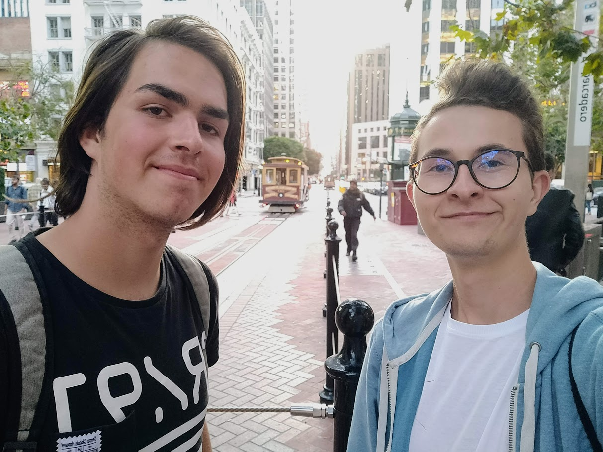

Když se náhodou potkají dva kamarádi ze základky 10 tisíc kilometrů od domova

Má americká rodina mě chtěla vzít do San Francisca hned, jak to bylo možné, nejdříve jsme se byli s Kieranem a Danem podívat do Exploritaria, což je muzeum, kde jsou všemožné vědecké experimenty. Tam se mi moc líbilo ale další zastávka to minimálně dorovnala, Golden Gate Bridge. Překvapilo mě, že most byl postavený až ve 30. letech 20. století. Prý je také bohužel místem, kde ukončilo svůj život mnoho lidí.

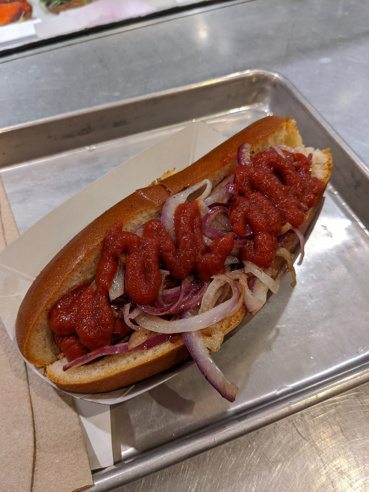
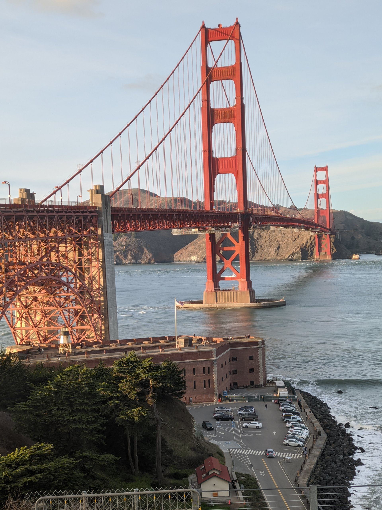
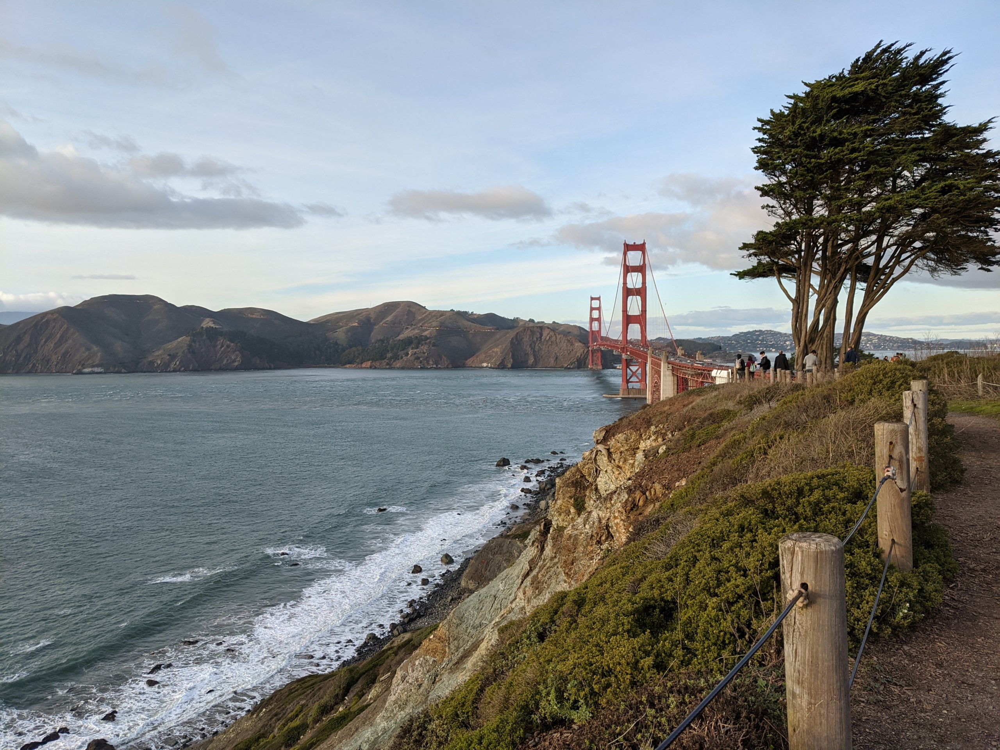
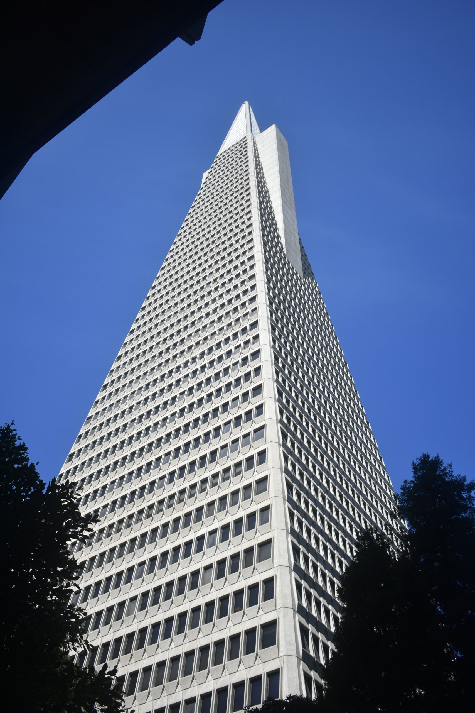
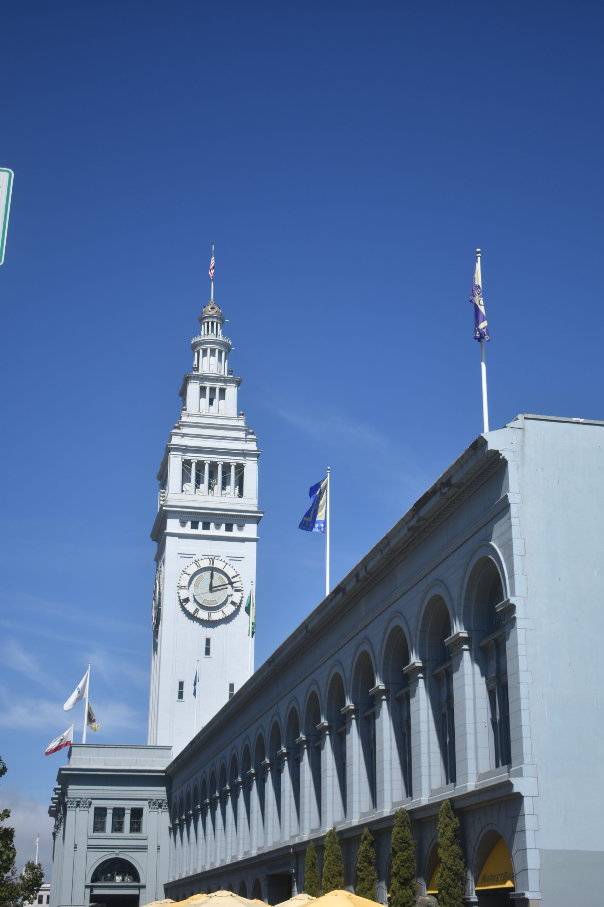
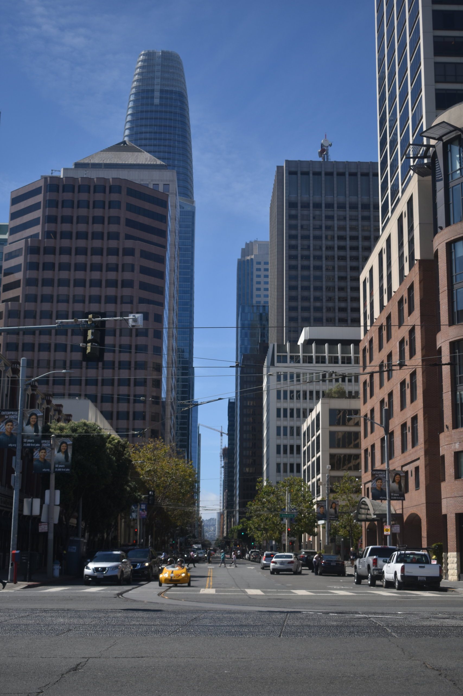
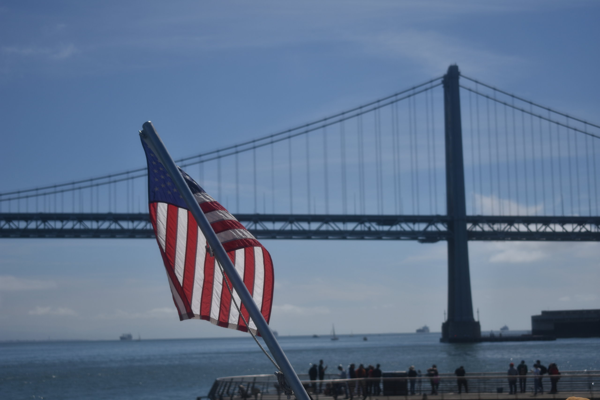
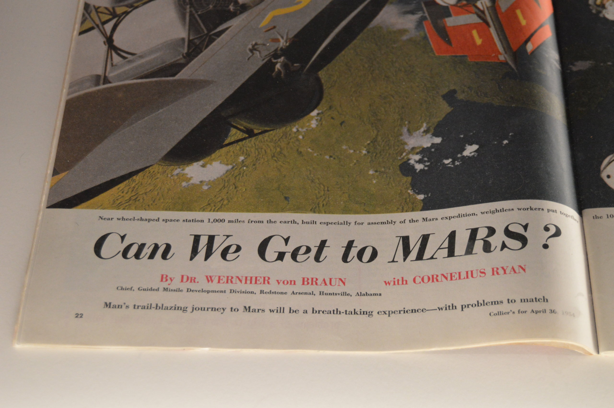
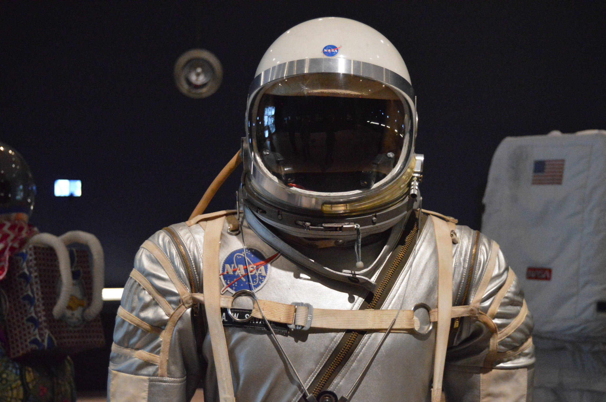
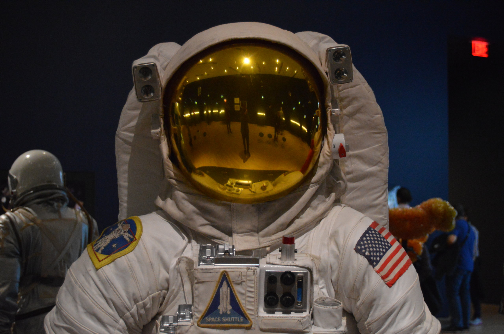

Jelikož miluji moderní technologie, tak mě nemohla minout ani přednáška od Prezidenta Microsoftu Brada Smitha, který byl v San Franciscu na přednášku v Commonwealth klubu, na kterou mě právě Maya upozornila. Na přednášku jsem jel s Liamem v BARTu (Bay Area Rapid Transport), prostě taková kombinace vlaku a metra, akorát mnohem méně spolehlivější než v Česku. Cestou zpátky jsme se s Liamem bavili o tom, jak funguje Evropský parlament a zničeho nic se do naší diskuse přidal další člověk v BARTu, který věřte tomu, nebo ne, v minulosti pracoval v Bruselu. Další ukázka toho, jak jsou Američané, řekl bych, zdravě drzí. Už jsem taky pochopil, proč prostě všichni amíci jezdí autem, protože jakákoli snaha vytvořit spolehlivou veřejnou dopravu se u nich vetšinou nezadaří. Každopádně zpátky k přednášce, Smith mluvil o využívání dat, jako paliva budoucí společnosti. A také o tom, jak bude důležité, aby státy nechávaly otevřená data všem svým občanům.

Mojí další technologickou zastávku jsem v San Franciscu měl díky místní reportérce v Orindě, která o mě napsala článek. Při rozhovoru jsem se totiž dozvěděl, že má syna, který pracuje v softwarové firmě v San Franciscu. Dala mi na něho kontakt a za pár dní jsem měl sjednanou prohlídku jedné z největších firem v IT odvětví, dnes už pod jménem VMvare. Marco, zmíněný syn novinářky, který tam dělal projektového manažera, mi ukázal jak to tam vypadá, nejdříve mají tzv. "velký standup", kde se sejdou všichni zaměstnanci firmy a řeknou si novinky ve firmě nebo jestli nenarazili na nějaký problém. Potom následuje "malý standup", kde se řeší konkrétní věci, které lidé v týmu zvládly za poslední den a stanoví si, na čem budou pracovat dneska. Mluvil jsem s jedním z Markových spolupracovníků, u kterého mě překvapilo, že když nastupoval, tak neměl v podstatě žádné zkušenosti s programovacím jazykem, který ve firmě využívali, vše se naučil až po pohovoru. Samozřejmě měl zkušenosti s jinými programovacími jazyky a měl za sebou vysokoškolský titul z Berkeley, ale i tak mě to zaskočilo.

V San Franciscu jsme byli i se školou, konkrétně s mým předmětem fotografování. Navštívili jsme Chinatown, kde mají mimochodem úplně nejlepší bao, vepřové knedlíčky dělané v páře viz fotka. Čínská čtvrť je v San Franciscu jedním z nejstarších svého druhu. Bydleli tady přistěhovalci, kteří přicházeli do USA od 19. století. My jsme si Chinatown prošli a ulovili pár fotek a bao. I přesto, že už jsem zpátky v České republice, tak budu pokračovat ve svém blogu, příště se můžete těšit na vysoké školy a sport v Americe!

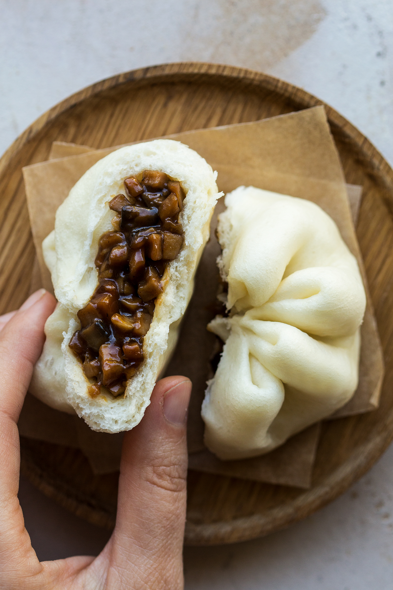

`youtube: https://www.youtube.com/watch?v=N-aK6JnyFmk`

Tématická písnička jako vždy :)
